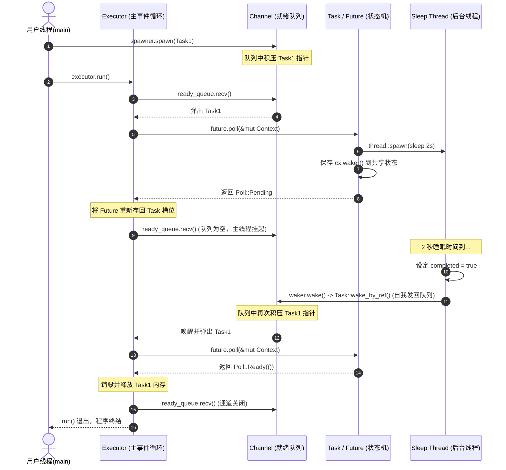

---
tags:
  - Rust
  - 异步原理
  - Mermaid
  - 全景故事
---

# Mini-Executor 物理图景大串联

在经历前四步的各个积木搭建后，我们用一副完整的**物理图景画卷**与 **Mermaid 时序图**，将一个延时 2 秒的睡眠任务在我们的自定义 `MiniExecutor` 中的流转生命周期完整复盘。

---

## 1. 物理运行全景故事

我们运行 [main 函数](file:///Users/linya/Code/Self/Rust/async_learning/mini_executor/src/main.rs#L217-L248)：

1. **工作区初始化**：
   - 调用 `new_executor_and_spawner` 创建一个就绪 Channel。
   - 实例化 `Executor` 和 `Spawner`。
2. **任务入队 (Spawn)**：
   - 派生任务 1：`spawner.spawn(async { ... TimerFuture::new(2).await; ... })`。
   - 该异步块被编译为包含 `TimerFuture` 状态的自引用结构体，被 Pin 在堆上，封装成 `Task`，发送到 Channel。
3. **引擎点火 (Event Loop 启动)**：
   - 丢弃主线程的 `spawner`（关键：确保当所有后台 spawn 任务执行完毕后，Channel 能正常关闭，防止 Executor 永久阻塞死锁）。
   - 调用 `executor.run()`。
4. **第一轮轮询 (First Poll)**：
   - Executor 从 Channel 中 pop 出任务 1。
   - 构造 `Context`，对任务 1 调用 `poll`。
   - 执行到 `.await` 处的 `TimerFuture::new(2)`：
     - 后台定时线程启动，开始 2 秒睡眠。
     - `TimerFuture` 发现 `completed` 为 `false`，将 Context 中的 `Waker` 深度拷贝保存到共享状态。
     - 返回 `Poll::Pending`。
   - 任务 1 被 Executor 重新塞回 `future_slot`，但**不再发回 Channel**。
5. **进入 CPU 友好型休眠 (Idle)**：
   - Channel 内目前空无一物。
   - Executor 线程执行 `ready_queue.recv()`，因通道无数据而被操作系统内核挂起挂起，**此时 CPU 占用率为 0%**。
6. **苏醒与重排队 (Wake & Enqueue)**：
   - 2 秒时间到！后台线程醒来，将 `completed` 改为 `true`。
   - 提取出 `waker`，调用 `waker.wake()`。
   - 触发虚函数指针路由，执行 `Task::wake_by_ref`。
   - 任务 1 克隆自身的 `Arc` 指针，再次发送入 Channel 中。
7. **第二轮轮询 (Second Poll)**：
   - 通道中有任务了！操作系统内核唤醒 Executor 线程。
   - Executor 从 `recv()` 中恢复执行，拿到任务 1，构建 `Context`，再次调用 `poll`。
   - 执行到 `TimerFuture` 的 `poll`：
     - 检查发现 `completed` 变成了 `true`。
     - 返回 `Poll::Ready(())`。
   - 任务 1 后续的 `println!` 代码得到执行，最后返回 `Poll::Ready(())` 结束。
8. **安全退出 (Safe Exit)**：
   - 任务 1 执行完毕，被销毁。
   - 此时所有的 Spawner 已被释放（Drop），通道发送端引用计数清零，Channel 关闭。
   - `recv()` 返回错误，跳出 `while let Ok` 循环，整个运行时安全宣告退场。

---

## 2. Mermaid 微观生命周期时序图

下面是该 2 秒睡眠任务的微观时钟周期流向：

---

## 🔗 上一步导航
- 上一步：[[Executor 事件循环与任务调度]]
- 返回 MOC：[[🧭 Rust 异步底层原理]]
